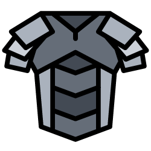

<!-- PROJECT LOGO -->
 

  

<h3 align="center">Chainmail</h3>

  

  Blockchain Email Solution
     
    <!--<a href="https://praggregator.herokuapp.com/swagger/"><strong>Explore the docs »</strong></a>-->
     
     
    <a href="https://chainmail.tech/">View Demo</a>
    ·
    <a href="https://github.com/johnunar/chainmail/issues">Report Bug</a>
    ·
    <a href="https://github.com/johnunar/chainmail/issues">Request Feature</a>
  

<!-- TABLE OF CONTENTS -->

## Table of Contents

* [About the Project](#about-the-project)
    * [Built With](#built-with)
* [Getting Started](#getting-started)
    * [Prerequisites](#prerequisites)
    * [Installation](#installation)
* [Usage](#usage)
    * [Authentication](#authentication)
* [Contact](#contact)

<!-- ABOUT THE PROJECT -->

## About The Project

TODO

### Built With

* [Solidity](https://docs.soliditylang.org/)
* [Ether.js](https://docs.ethers.io/v5/)
* [Hardhat](https://hardhat.org/)
* [Polygon](https://polygon.technology/)

## Getting Started

TODO

### Prerequisites

TODO

### Installation

TODO

## Usage

TODO

### Authentication

TODO

<!-- CONTACT -->

## Contact

Jan Unar

* [johnny@unar.dev](mailto:johnny@unar.dev)
* [unar.dev](https://unar.dev/)

Project Link: [https://github.com/johnunar/chainmail](https://github.com/johnunar/chainmail/)